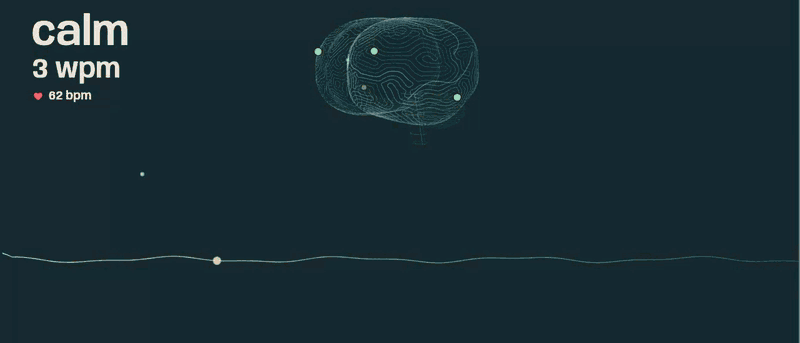
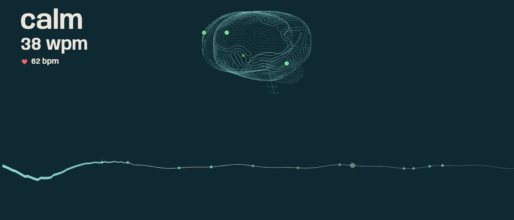
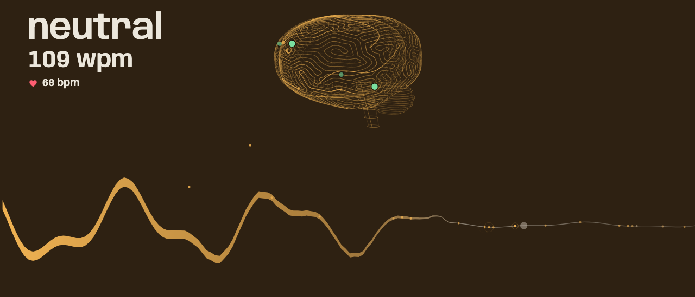
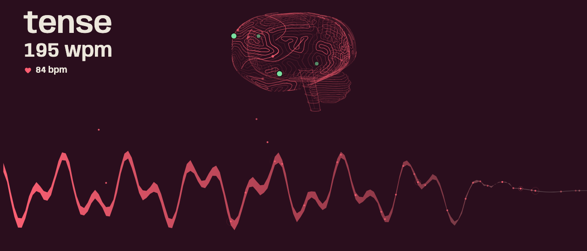
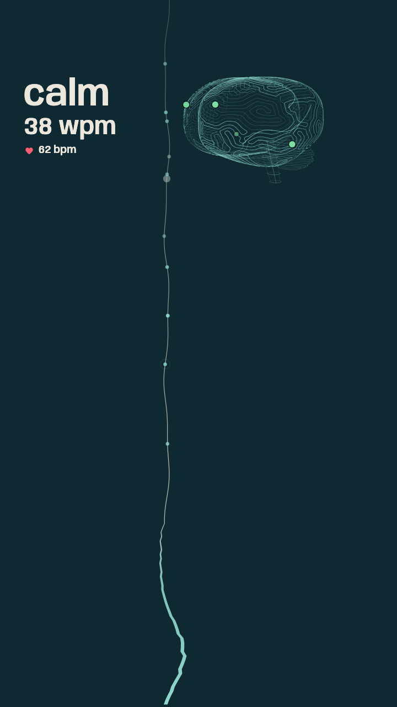
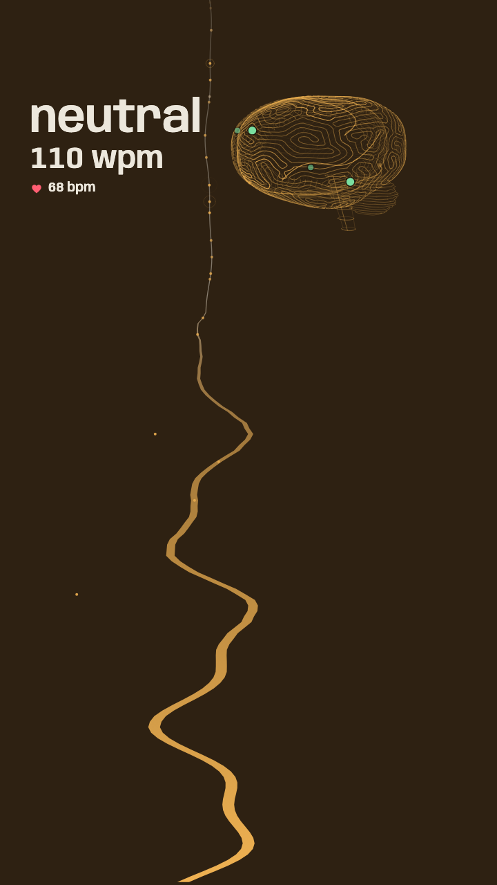
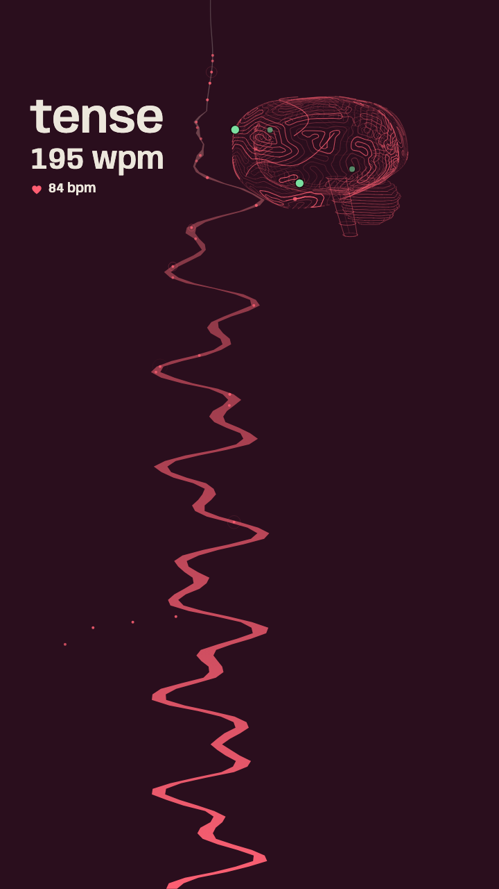
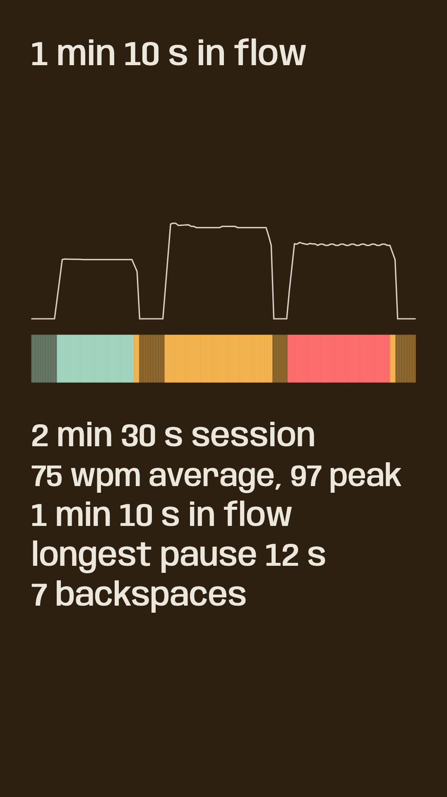
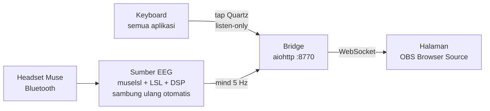

<h1 align="center">TypeWave</h1>

<p align="center">
  <b>Lihat otakmu saat mengetik.</b><br>
  Visualisasi realtime ketikan global dan EEG (Muse) untuk OBS dan TikTok LIVE.<br>
  <i>See your brain while you type: a realtime typing + EEG visualizer for OBS and TikTok LIVE.</i>
</p>

<p align="center">
  <a href="https://github.com/freakandstein/typewave/actions/workflows/tests.yml"></a>
  <a href="LICENSE"></a>
  <a href="https://freakandstein.github.io/typewave/?lang=id"></a>
</p>

<p align="center">
  <a href="https://freakandstein.github.io/typewave/?lang=id"><b>Coba demo di browser</b></a>
  (tanpa headset; ketik di keyboard-mu dan geser slider)
  &nbsp;&middot;&nbsp; <a href="TYPEWAVE_SPEC.md">Spesifikasi</a>
</p>

<p align="center">
  
</p>

## Sekilas

Satu pita cahaya bereaksi pada dua hal sekaligus: **ketikanmu** (setiap tombol di aplikasi mana pun) dan **kondisi otakmu** dari headset EEG Muse. Warna, bentuk gelombang, dan ilustrasi otak mengikuti kondisi tenang (calm), netral (neutral), atau tegang (tense). Halaman dipasang sebagai Browser Source di OBS, jadi cocok untuk konten typing, ASMR keyboard mechanical, dan live TikTok.

- **Dua sumber, satu gambar:** kerapatan dan irama ketikan mengatur tinggi, kecepatan, dan ketebalan pita. EEG mengatur warna, kekasaran, bentuk gelombang, dan terang tiga jenis garis di ilustrasi otak (theta, alpha, beta).
- **Siap OBS:** bingkai horizontal 21:9 (bisa 16:9 sampai 3:1) dan vertikal 9:16 untuk TikTok. Kartu laporan sesi bisa diekspor sebagai PNG.
- **Mandiri:** membaca Muse langsung lewat Bluetooth dengan sambung ulang otomatis, tanpa server EEG lain. Tanpa headset? Pakai demo atau simulator.
- **Status headset terlihat:** halaman menulis apa yang sedang terjadi (menyambung, menyambung ulang percobaan ke-N, menyiapkan sinyal, cek sensor), dan empat titik kecil menunjukkan tiap sensor Muse: hijau = menempel baik, kuning = kurang bagus, cincin merah = buruk. Berguna saat memasang headset dan saat sambungan putus.
- **Privat:** hanya kode tombol fisik yang dipakai (tidak pernah karakter), dan tidak ada ketikan yang disimpan.

**In English:** TypeWave draws one ribbon of light that reacts to every keystroke on your machine (any app) and to your brain state from a Muse EEG headset. Colors, wave shape, and a slowly rotating 3D brain drawn in thin see-through lines (three line groups for theta, alpha, and beta) follow calm, neutral, and tense. It runs as an OBS Browser Source (horizontal or 9:16 vertical for TikTok), reads the headset over Bluetooth with automatic reconnect, and needs no other EEG server. No headset? Try the [live demo](https://freakandstein.github.io/typewave/) or run `npm run start:fake`. Four dots on the brain, at the real Muse sensor positions, show whether each sensor has good contact, and the HUD says what the headset link is doing (connecting, reconnecting, attempt N). Only physical key codes are used, never characters, and nothing is written to disk.

## Galeri

<p align="center">
  <a href="docs/media/wide-calm.png"></a>
  <a href="docs/media/wide-flow.png"></a>
  <a href="docs/media/wide-tense.png"></a>
</p>
<p align="center">
  <a href="docs/media/tall-calm.png"></a>
  <a href="docs/media/tall-flow.png"></a>
  <a href="docs/media/tall-tense.png"></a>
  <a href="docs/media/report-tall.png"></a>
</p>
<p align="center"><sub>Tenang (calm), netral (neutral), tegang (tense) di layout horizontal dan vertikal 9:16, dan kartu laporan sesi hasil ekspor aplikasi.</sub></p>

## Cara kerja



## Mulai cepat

```bash
git clone https://github.com/freakandstein/typewave
cd typewave
npm install
python3 -m venv .venv
.venv/bin/pip install -r bridge/requirements.txt -r eeg/requirements.txt
npm start
```

Nyalakan headset Muse sebelum `npm start` (atau pakai `npm run start:fake` tanpa headset), lalu buka `http://127.0.0.1:8770/`. Butuh macOS, Node 22+, dan Python 3.12+; izin dan rinciannya ada di bagian berikut.

## Coba tanpa headset

- **Demo online:** https://freakandstein.github.io/typewave/ (tambahkan `?lang=id` untuk label Indonesia). Halaman mengetik sendiri dan kondisi otak mengembara; ketik di keyboard-mu atau geser slider di kanan bawah.
- **Sesi contoh (2,5 menit):** https://freakandstein.github.io/typewave/?replay=sample-session&ws=off (tekan `R` untuk kartu laporan).
- **Di komputermu:** `npm run start:fake` (EEG palsu), atau buka `http://127.0.0.1:8770/?demo=1`.

## Status

Beta. Yang diuji otomatis: pemrosesan sinyal EEG, sambung ulang headset (dengan streamer dan emulator Bluetooth palsu), bridge, dan halaman (Playwright). Yang belum diuji dengan perangkat sungguhan: koneksi Bluetooth ke Muse, tampilan di OBS dan TikTok LIVE Studio, dan listener ketikan di semua aplikasi. Rinciannya ada di bagian 12 [TYPEWAVE_SPEC.md](TYPEWAVE_SPEC.md) (butir bertanda "kamu").

## Persiapan

Butuh macOS, Node 22+ (dipakai: Node 26), Python 3.12+ (dipakai: 3.14; cek `.venv/bin/python --version`), dan Chrome.
Headset: Muse 2 lewat Bluetooth (Muse S generasi lama memakai protokol yang sama; Muse S Athena belum diuji). Tidak perlu bila memakai EEG palsu.

```bash
npm install
python3 -m venv .venv      # pakai Python 3.12 atau lebih baru
.venv/bin/pip install -r bridge/requirements.txt -r eeg/requirements.txt
.venv/bin/pip install -r adapters/requirements.txt   # hanya bila memakai server EEG lama (opsional)
npx playwright install chromium   # hanya untuk tes dan video demo
```

## Menjalankan

```bash
npm start                 # bridge + sumber EEG (headset Muse dibaca langsung); keduanya diawasi dan dijalankan ulang bila mati
npm run start:fake        # sama, dengan EEG palsu (tanpa headset)
npm run bridge            # hanya bridge, port 8770 (tanpa EEG)
```

Lalu buka `http://127.0.0.1:8770/` (atau `?sim=1` untuk mencoba tanpa EEG sama sekali: panel simulator di pojok kanan bawah dengan slider tenang-tegang, detak jantung, kualitas sinyal, dan level gelombang theta, alpha, beta).
Jalankan dari **Terminal.app**, bukan dari terminal editor yang bisa mematikan proses saat idle. Ctrl+C menghentikan semuanya.

## Apa memengaruhi apa

| Sumber | Memengaruhi |
|---|---|
| Ketikan: kerapatan tombol per detik | tinggi gelombang pita dan kecepatan gesernya |
| Ketikan: WPM | ketebalan pita (pita "istirahat" setelah 3 detik tanpa ketikan) |
| Ketikan: tiap tombol | bead, sapuan Enter, batang Space, satu percikan di ilustrasi otak (siluet keyboard hanya dengan `?keyboard=1`) |
| EEG: `spectrum_pos` (tenang ke tegang) | warna seluruh frame, kekasaran tepi, panjang gelombang dan kehalusan gelombang (tenang = panjang dan mulus, tegang = rapat dan patah), dan seberapa gelisah lipatan otak |
| EEG: detak jantung (`hr`) | angka `bpm` dengan ikon hati di HUD (ikonnya diam, tidak berdenyut) dan latar "bernapas" (ilustrasi otak tidak ikut berdenyut) |
| EEG: level theta, alpha, beta | terang tiga jenis garis di ilustrasi otak (panjang = theta lambat, sedang = alpha, pendek = beta cepat) dan jenis garis yang dinyalakan percikan ketikan |
| EEG: status sambungan dan kualitas tiap sensor | teks status di HUD dan empat titik sensor di otak 3D; tidak mengubah warna atau gelombang (bagian EEG di bawah) |

Bentuk dasar gelombang dibuat dari rumus sinus; yang membawa data adalah tinggi, kecepatan, panjang gelombang, dan kehalusannya.

Teks HUD (kondisi, wpm, detak jantung, status) selalu sama besar dan tebal, apa pun kondisi otaknya, dan angkanya berlebar tetap sehingga tidak bergoyang saat berganti, supaya tetap terbaca di OBS. HUD tidak menampilkan timer sesi. Ketebalannya satu angka di `CONFIG.type.hudWght` di `src/config.js` (bawaan 600; naikkan sampai 900 untuk lebih tebal).

Ilustrasi otak di atas tengah adalah otak 3D dari garis tipis yang selalu berputar perlahan (sekitar 20 detik per putaran, kecepatannya tetap dan tidak mengikuti ketikan atau kondisi otak) dan digambar tembus pandang: garis di belakang tetap tampak, hanya lebih redup. Ini hiasan, bukan peta aktivitas otak: sumber EEG hanya mengirim angka gabungan, bukan per area, jadi titik yang menyala saat mengetik tidak menunjukkan bagian otak yang sebenarnya. Bentuknya dibuat oleh `node tools/gen_brain.mjs` (seed tetap, sekitar 30 detik, hasilnya `src/data/brain.js`); ukuran dan posisinya ada di `CONFIG.layout.*.brain` di `src/config.js`, kecepatan putar di `CONFIG.brain.spin`, dan terang menurut kedalaman di `CONFIG.brain.depth`. Matikan dengan `?brain=0`.

Tiga jenis garis otak mengikuti tiga gelombang: garis panjang untuk theta (lambat), sedang untuk alpha, pendek untuk beta (cepat). Tiap jenis menerangi diri pelan-pelan sesuai level gelombangnya saat itu (level dari sumber EEG dibandingkan dengan riwayat dirimu sendiri beberapa detik terakhir, jadi terang berarti "sedang tinggi dibanding barusan"), dan titik cahaya ketikan lebih sering memilih jenis yang levelnya tinggi. Ini metafora, bukan peta: letak garis tidak mewakili area otak. Otak kecil di belakang-bawah tidak ikut dan terangnya tetap. Tanpa data gelombang semua jenis sama terang.

## Izin macOS

Listener global membaca setiap key-down (hanya keycode fisik, tidak pernah karakter) lewat tap Quartz listen-only.

1. **Input Monitoring** (wajib): System Settings > Privacy & Security > Input Monitoring > tambahkan dan aktifkan
   aplikasi yang menjalankan bridge (Terminal.app). Setelah memberi izin, jalankan ulang bridge.
2. **Accessibility** (hanya untuk `tools/autotype.py` dan tes OS): aplikasi yang menjalankan skrip itu.

Periksa status listener: `curl http://127.0.0.1:8770/status` → `listener`:

| Nilai | Arti |
|---|---|
| `ok` | listener berjalan |
| `no-permission` | izin Input Monitoring belum ada; bridge mencetak instruksi dan mencoba lagi tiap 3 detik |
| `secure-input` | macOS secure input aktif (kolom password, atau "Secure Keyboard Entry" menyala): ketikan tidak terbaca. Ini perilaku macOS, bukan bug |
| `off` | bridge dijalankan dengan `--no-listener` |

## OBS

OBS hanya menampilkan URL lokal sebagai Browser Source; tidak ada integrasi atau kontrol OBS.

1. Sources > + > Browser.
2. URL `http://127.0.0.1:8770/?layout=wide`, lebar 1920, tinggi 823 (bingkai horizontal bawaan 21:9), FPS 60. Mau tinggi penuh 1080 (16:9)? Tambahkan `&ratio=16:9`. Mau lebih pendek lagi? `&ratio=3:1` (tinggi 640).
3. Matikan "Control audio via OBS". Matikan "Shutdown source when not visible" (supaya statistik sesi tidak ter-reset).
4. Untuk 9:16 (TikTok) pakai `?layout=tall` dengan kanvas 1080×1920. Safe zone: bagian bawah 20%, kanan 15%, atas 10%
   bebas dari elemen penting (perkiraan; periksa dengan tampilan nyata di TikTok LIVE Studio).

Browser Source tidak menerima keyboard: kartu laporan dipicu hotkey global (di bawah).

## Monitor kecil di atas keyboard

Buka `http://127.0.0.1:8770/?controls=1` di Chrome **sebelum sesi mulai** (supaya datanya sama dengan yang di OBS).
Tab ini menampilkan tombol ekspor PNG (1920×1080 dan 1080×1920) di pojok kanan bawah, selalu terlihat. Ekspor memakai data sesi tab itu sendiri.

## Hotkey

Di Mac, `ctrl` berarti **Control** (⌃) dan `alt` berarti **Option** (⌥), bukan Command (⌘). Tekan Control dan Option bersamaan, lalu hurufnya. Tidak perlu Fn.

| Hotkey | Fungsi |
|---|---|
| Control + Option + P (`ctrl+alt+p`) | pause: bridge berhenti meneruskan key; halaman menampilkan `paused`. Tekan lagi untuk lanjut |
| Control + Option + R (`ctrl+alt+r`) | tampil/tutup kartu laporan (9 detik lalu menutup sendiri) |
| `R` / `Esc` | tampil/tutup kartu laporan, hanya bila halaman sedang fokus (tab biasa) |

Listener hanya membaca, jadi chord hotkey tetap sampai ke aplikasi yang sedang fokus; pilih aplikasi yang tidak memakai chord itu.

## Parameter URL

| Param | Nilai | Default |
|---|---|---|
| `layout` | `wide` (horizontal), `tall` (vertikal 9:16 untuk TikTok), `auto` (menurut bentuk jendela: vertikal bila lebih tinggi daripada lebar) | `wide` |
| `fit` | `contain` (bingkai utuh di tengah jendela, sisanya bilah hitam), `fill` (memenuhi jendela, tampilan diregangkan) | `contain` |
| `ratio` | bentuk bingkai horizontal (lebar:tinggi): `21:9`, `16:9`, `2.5:1`, `3:1`, atau angka desimal; dibatasi 16:9 sampai 3:1; hanya untuk `wide` | `21:9` (`16:9` dengan `?keyboard=1`) |
| `demo` | `0`, `1` (simulator yang hidup sendiri: mengetik dan mengembara tanpa bridge dan tanpa headset, dengan keterangan dan tautan ke repo) | otomatis `1` bila halaman dibuka dari host selain `127.0.0.1` (mis. GitHub Pages), selain itu `0` |
| `transparent` | `0`, `1` | `0` |
| `privacy` | `zone`, `exact` | `zone` |
| `sim` | `0`, `1` | `0` |
| `replay` | nama file di `replay/` tanpa `.json` | kosong |
| `lang` | `en`, `id` | `en` |
| `ws` | URL WebSocket, atau `off` | `ws://127.0.0.1:8770/ws` |
| `debug` | `0`, `1` (overlay fps, jumlah key, status listener) | `0` |
| `controls` | `0`, `1` (tombol ekspor PNG) | `0` |
| `keyboard` | `0`, `1` (siluet keyboard di bawah pita; pita naik ke tengah layar) | `0` |
| `brain` | `0`, `1` (ilustrasi otak di atas tengah) | `1` |
| `contact` | `0`, `1` (empat titik sensor Muse di otak saat headset tersambung; teks status tetap tampil) | `1` |

Halaman selalu menampilkan bingkai horizontal 21:9 (`wide`, bentuknya bisa diubah dengan `?ratio=`) atau vertikal 9:16 (`tall`) yang utuh di tengah jendela, jadi komposisinya sama dengan di OBS apa pun bentuk jendelanya; jendela yang bentuknya berbeda mendapat bilah hitam (transparan dengan `?transparent=1`). Di OBS dengan ukuran sumber 1920×823 (21:9; atau 1920×1080 dengan `?ratio=16:9`, atau 1080×1920 untuk `tall`) bingkai memenuhi sumber tanpa bilah.

`privacy=zone` (default) mengacak posisi bead di dalam rentang tangan (dan, dengan `?keyboard=1`, hanya menyalakan zona tangan di siluet); `exact`
menampilkan kolom tombol persis (dan tombolnya di siluet) untuk konten ASMR yang keyboard-nya memang tampil di kamera.

## Simulator dan tools

```bash
.venv/bin/python tools/inject.py --count 200 --rate 15      # key palsu lewat WebSocket (tanpa izin macOS)
.venv/bin/python tools/inject.py --kind mind --count 50 --rate 5 --pos 0.2 --theta 0.9 --alpha 0.8 --beta 0.1   # mind dengan level gelombang
.venv/bin/python -m tools.autotype --count 200 --countdown 3 # tombol sungguhan lewat OS (fokuskan jendela target!)
node tools/gen_session.mjs                                  # membuat ulang replay/sample-session.json (sintetis)
.venv/bin/python -m eeg --fake relaxed                      # sumber EEG palsu saja (profil relaxed, focused, tense, mixed) ke bridge yang sudah jalan
npm run start:fake -- --fake-degrade AF7:flat@20-40         # EEG palsu dengan sensor AF7 kontaknya buruk dari detik 20 sampai 40 (jenis flat, noisy, wild; boleh diulang)
.venv/bin/python -m tools.fake_eeg_server --wander          # server EEG palsu di :8765, hanya untuk adapter lama (pos dan level gelombang bergerak)
```

Replay tanpa headset dan tanpa bridge: `http://127.0.0.1:8770/?replay=sample-session&ws=off`.

## EEG

Sumber EEG ada di project ini (paket `eeg/`); tidak butuh server EEG lain. `npm start` menjalankannya bersama bridge. Terpisah: `npm run eeg` (headset) atau `npm run eeg -- --fake` (palsu).

Alurnya: headset Muse (Bluetooth) → streamer sendiri (`eeg/muse_streamer.py`: muselsl dengan dua penyesuaian macOS) di proses terpisah → LSL → pemrosesan sinyal (kualitas kanal, deteksi otot di dahi, level theta/alpha/beta, detak jantung dari PPG) → pesan `mind` dan `headset` 5 kali per detik ke bridge. Sekitar 17 detik pertama setelah tersambung belum ada `mind` (jendela sinyal 2 detik + warm-up 15 detik): halaman menulis "menyiapkan sinyal" lalu hidup sendiri.

**Pertama kali:** nyalakan headset, jalankan `npm start`. Headset dipindai lewat Bluetooth dan alamatnya disimpan di `eeg/.device.json`. Bila ada beberapa headset: `npm run eeg -- --scan` menampilkan daftarnya, lalu `npm start -- --name Muse-1A2B` (atau `--address`).

### Sambung ulang otomatis

Cara kerja ini diadopsi dari project EEG (loop sambung ulang di `brainflow_connector.py`) dan ditulis ulang di `eeg/supervisor.py`, `eeg/stream.py`, `eeg/bridge_link.py`:

- Headset mati, keluar jangkauan, atau Bluetooth macet: terdeteksi dalam sekitar 5 detik (proses streamer mati, atau tidak ada sampel EEG selama 5 detik) lalu **disambung ulang tanpa batas** dengan jeda 3, 5, 10, lalu 15 detik. Jeda kembali ke 3 detik setelah sambungan bertahan 30 detik, dan tiap 3 kegagalan beruntun alamat dipindai ulang (alamat Bluetooth bisa berubah). Tidak perlu menjalankan ulang apa pun.
- Selama putus tidak ada data basi yang dikirim: halaman menulis "menyambung ulang, percobaan N" (bukan sekadar "no signal") dan pulih sendiri begitu data kembali (tanpa warm-up ulang).
- Bridge mati lalu hidup lagi: sumber EEG menyambung lagi sendiri (jeda 1, 2, 5 detik) dan `npm start` menjalankan ulang proses yang mati.
- Ctrl+C menghentikan seketika, bahkan saat sedang menunggu jeda, dan streamer ikut dimatikan (sumber EEG dimatikan lebih dulu, bridge terakhir). Hal yang sama untuk SIGTERM dan SIGHUP (jendela Terminal ditutup).
- Bila sumber EEG mati keras, streamer keluar sendiri dalam beberapa detik (supaya tidak menahan koneksi Bluetooth), dan sisa dari sesi yang mati mendadak dibersihkan saat start berikutnya.
- Terminal mencetak sebab dan jedanya, mis. `koneksi headset putus: tidak ada sampel EEG selama 5 detik ...; mencoba lagi dalam 3 detik (percobaan 1)`.

### Status headset dan titik sensor

Sumber EEG mengirim pesan `headset` 5 kali per detik, terpisah dari `mind` dan juga saat `mind` tidak ada: justru ketika headset baru dipasang dan semua sensor masih buruk tidak ada `mind`, dan di saat itulah kamu perlu tahu penyebabnya.

| Teks di HUD (en / id) | Artinya |
|---|---|
| `connecting to headset` / `menyambung ke headset` | sedang memindai dan menyambung |
| `reconnecting, attempt 2` / `menyambung ulang, percobaan 2` | sambungan putus; sedang percobaan ke-2 (tampil segera, tanpa menunggu data lama basi) |
| `warming up` / `menyiapkan sinyal` | baru tersambung (atau tersambung ulang); menunggu jendela sinyal dan warm-up 15 detik |
| `check the sensors` / `cek sensor` | tersambung, tetapi tidak ada satu pun sensor hijau sehingga tidak akan ada `mind`: headset belum menempel rapat |
| `EEG source offline` / `sumber EEG terputus` | tidak ada kabar dari sumber EEG lebih dari 3 detik (dihitung sejak halaman tersambung lagi bila bridge sempat mati), atau sumbernya berhenti (jalankan `npm start`) |
| `bridge disconnected` / `bridge terputus` | halaman kehilangan bridge; pulih sendiri saat bridge hidup lagi |
| `no signal` / `tanpa sinyal` | seperti dulu: tidak ada data dan sumber EEG belum pernah terlihat (mis. tanpa headset) |

Empat titik di otak 3D berada di posisi sensor Muse pada kepala: dua di dahi kiri dan kanan (AF7, AF8) dan dua di samping bawah di belakang telinga (TP9, TP10). Titiknya ikut berputar bersama otak dan tetap tampak di sisi belakang (lebih kecil dan redup). **Hijau** = sinyal bagus, dipakai untuk menghitung level otak; **kuning** = kurang bagus (sangat tipis atau berisik), belum dipakai; **cincin merah** = buruk (datar atau liar), tidak dipakai, biasanya sensor belum menempel pada kulit. Warna dihaluskan 1,5 detik, jadi kedipan sesaat tidak mengubahnya, dan titik hanya tampil selama tersambung. Satu sensor yang tidak hijau tidak menghentikan apa pun: `mind` tetap dihitung dari sensor hijau yang tersisa (minimal satu). `?contact=0` menyembunyikan titik (teks status tetap).

Kualitas dihitung dari simpangan baku sinyal 2 detik terakhir dengan ambang yang sama seperti pemrosesan sinyal (kanal di bawah 0,65 tidak dipakai). Ambang itu belum dicoba dengan headset sungguhan, jadi bisa perlu disetel. Teks galat (yang bisa memuat alamat Bluetooth) sengaja tidak dikirim ke halaman, karena halaman ini tampil di layar siaran.

### Yang perlu diperhatikan

- **Izin Bluetooth:** Terminal.app harus diizinkan di System Settings > Privacy & Security > Bluetooth (macOS menanyakannya saat pertama kali memindai).
- **Satu klien per headset:** Muse hanya melayani satu koneksi Bluetooth. Tutup aplikasi lain yang memakai headset yang sama (aplikasi Muse, server EEG lama), kalau tidak sumber ini tidak akan tersambung.
- **Streamer sendiri, bukan muselsl polos:** menurut sumber bleak dan muselsl, muselsl 2.5.0 polos mati pada setiap sambungan di macOS (CoreBluetooth menolak langganan kanal kontrol yang didaftarkan dua kali), dan watchdog 3 detik bawaannya bisa memutus sambungan yang sehat saat paket PPG hilang. `eeg/muse_streamer.py` memperbaiki keduanya. Keduanya terbukti di tes dengan muselsl asli di bawah emulator BLE (`test/bridge/fake_ble.py`), belum dengan headset (lihat di bawah).
- **Belum dicoba dengan headset sungguhan:** emulator meniru aturan CoreBluetooth dan format paket Muse, tetapi radio Bluetooth dan beberapa asumsi muselsl di macOS (mis. pemetaan handle karakteristik) hanya terbukti dengan headset sungguhan. Bila `npm start` tidak mendapat data, jalankan streamer sendirian untuk melihat keluaran muselsl: `.venv/bin/python eeg/muse_streamer.py <alamat dari npm run eeg -- --scan>`.
- **Satu instance:** satu `npm start` atau `npm run eeg` per folder status (`eeg/`, kunci `eeg/.eeg.lock`); yang kedua keluar dengan kode 3 dan pesan yang jelas.
- **Python untuk streamer:** muselsl dan bleak dijalankan oleh Python venv ini. Bila muselsl bermasalah di versi Python ini, pakai Python lain yang punya muselsl: `npm start -- --python /path/ke/python`.
- **Log liblsl senyap:** banner dan baris `ERR Stream transmission broke off` dari liblsl disembunyikan (yang tercatat hanya log sambung ulang di atas). Ini hanya berlaku bila kamu tidak punya konfigurasi LSL sendiri (`LSLAPICFG` atau `lsl_api.cfg`), supaya pengaturan jaringanmu tidak tertimpa.
- **Tanpa mental command:** sumber ini hanya membaca dan tidak pernah menembakkan keystroke, jadi typing mode (di bawah) tidak diperlukan.
- Level theta/alpha/beta dinormalisasi terhadap riwayat dirimu sendiri (persentil 10 sampai 90 dari ±18 detik terakhir), jadi "terang" berarti sedang tinggi dibanding barusan, bukan kekuatan absolut. Ambang tenang-tegang (`pos`) memakai median 2 menit terakhir, jadi beberapa menit pertama masih menyesuaikan diri.
- Mute drum engine saat merekam ASMR (mic menangkap suara keyboard).

### Server EEG lama (opsional)

Bila kamu tetap memakai server EEG di project terpisah (`eeg_server.py` di `127.0.0.1:8765`), adapter berlangganan event `state_update`:

```bash
.venv/bin/python -m adapters.eeg_socketio    # --eeg http://127.0.0.1:8765 --bridge ws://127.0.0.1:8770/ws
```

- `pos` dari `spectrum_pos`, `hr` dari `heart_rate` (bukan `bpm`: itu tempo drum engine), `q` = rata-rata `channel_quality`, dan `theta`, `alpha`, `beta` (level gelombang 0..1) diteruskan apa adanya.
- Adapter berhenti mengirim saat `warming_up`, headset putus, atau `eeg_active` false; halaman lalu jatuh ke grade netral "no signal".
- **Typing mode (hanya dengan server EEG lama):** command mental EEG memetakan huruf biasa (`a d e q s w x`) dan sebagian ditembak lewat Quartz HID tap yang
  meniru hardware, jadi tidak bisa dibedakan dari ketikan asli. Sebelum merekam typing, kosongkan atau nonaktifkan pemetaan
  command mental di sisi EEG. Adapter mencetak peringatan bila ada command yang menembak.
- Jangan jalankan bersamaan dengan `npm start` untuk headset yang sama (satu klien Bluetooth per headset).

## Privasi dan keamanan

- Yang dikirim hanya kode tombol fisik; listener tidak pernah menerjemahkan keycode ke karakter. Tidak ada key yang disimpan ke disk.
- Bridge hanya listen di `127.0.0.1`; WebSocket menolak `Origin` dan `Host` asing (tanpa ini, situs mana pun di browser bisa
  membaca aliran ketikan lewat localhost).
- macOS memblokir listener di kolom password. Prompt password di terminal biasanya tidak memicu secure input kecuali
  "Secure Keyboard Entry" dinyalakan; tekan Control + Option + P sebelum mengetik password di terminal.

## Tes

```bash
npm test                               # unit (node --test)
npm run test:bridge                    # Python (unittest): bridge, sumber EEG, peluncur; ±2 menit karena memakai proses dan LSL sungguhan
npm run test:e2e                       # e2e Playwright (bridge + Chromium headless + sumber EEG palsu); ±3 menit
TYPEWAVE_OS_TESTS=1 npm run test:e2e   # + event OS sungguhan (butuh izin macOS; membuka jendela Chrome)
TYPEWAVE_PERF=1 npm run test:e2e       # + fps di Chrome sungguhan (±70 detik)
TYPEWAVE_SOAK=1 npm run test:e2e       # + soak 10 menit
```

Tes sumber EEG memakai dua pengganti headset: streamer LSL palsu (`tools/fake_muse_lsl.py`: mati, crash, macet, gagal tersambung) dan emulator BLE (`test/bridge/fake_ble.py`) yang menggerakkan muselsl asli dengan aturan CoreBluetooth dan paket EEG/PPG berformat Muse. Koneksi Bluetooth ke headset sungguhan tidak bisa dites otomatis; itu butir yang perlu dicoba sendiri (spec bagian 12, butir 33).

Semua konstanta tuning (warna, ukuran, kecepatan, arah pita `RIBBON_DIR` lewat `ribbon.dir`) ada di `src/config.js`.

## Lisensi

[MIT](LICENSE). Font Anybody memakai SIL Open Font License ([assets/fonts/OFL.txt](assets/fonts/OFL.txt)).
